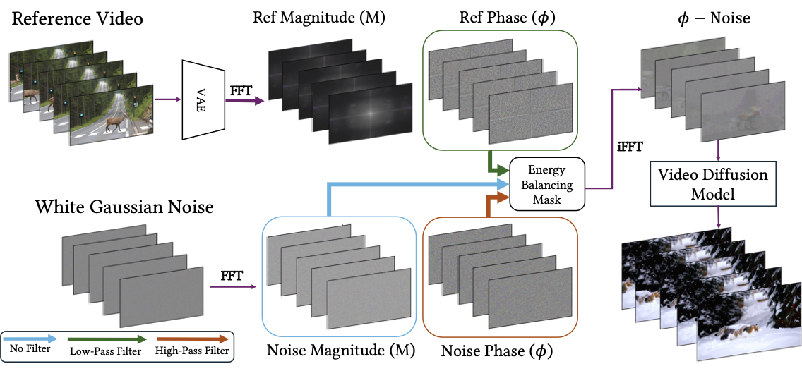

# ϕ-Noise — Project Page

Academic project page for:

> **ϕ-Noise: Training-Free Temporal Video Conditioning via Phase-Based Noise Manipulation**
> Ofir Abramovich*, Nadav Z. Cohen*, Adi Rosenthal*, Ariel Shamir
> Canvas-Lab, Reichman University · 2025

---

## File Structure

```
phi-noise-project/
│
├── index.html                  ← Main page (edit this)
│
├── assets/                     ← Images used by the page (small files)
│   ├── method_v1.png
│   ├── analysis.png
│   └── teaser_gif.gif

├── static/media/               ← Video media (moved here for easier deployment)
│   ├── comparisons/            ← Example comparison videos grouped by task
│   ├── results/                ← teaser/result videos (t1.mov, t2.mov, t3.mov)
│   └── teaser.mov
│
├── static/                     ← Frontend source (styles + scripts)
│   ├── css/
│   │   └── style.css           ← All styles & design tokens
│   └── js/
│       └── main.js             ← Tab switching, nav highlight, BibTeX copy
│
└── README.md
```

---

## How to Replace Placeholders

### Teaser video
The site uses `assets/teaser.mov` by default. To replace it, edit the `<video>` block in `index.html` and point the `<source>` to your file (keeps the `responsive-video` class):

Local file example:
```html
<video autoplay muted loop playsinline class="responsive-video">
  <source src="assets/teaser.mov" type="video/mp4">
</video>
```

You can also embed YouTube using an `<iframe>` if you prefer.

### Application videos
Place example videos under `assets/` (or any path you prefer) and reference them from `index.html`. The page uses semantic classes now:

Inline example (non-lazy):
```html
<video autoplay muted loop playsinline class="comparison-video">
  <source src="assets/comparisons/.../example.webm" type="video/webm">
</video>
```

Lazy-load example (recommended for many videos):
```html
<video autoplay muted loop playsinline data-src="assets/comparisons/.../example.webm" class="comparison-video"></video>
```
The `main.js` script will set the `src` when the video enters the viewport.

### Method figure image
The method figure and other images live in `assets/` by default. Use the `figure-image` class for consistent sizing:
```html

```

### Links
Update the `href="#"` placeholders on the CTA buttons in `index.html`:
- Paper → arXiv URL
- Code  → GitHub repo URL
- Supplemental Video → YouTube / project drive URL
- Dataset → download link

### Authors
Replace `href="#"` on each `<a>` tag in the authors block with personal homepages.

---

### Customisation

| What | Where |
|------|-------|
| Colors / fonts | `:root` block at top of `static/css/style.css` |
| Add more examples | Duplicate a `comparison-row` block in `index.html` |
| Add a new tab | Add a `<button class="tab-btn" data-tab="NEW">` and a matching `<div class="tab-panel" data-panel="NEW">` |
| Change venue badge | Edit `<div class="venue-badge">` in `index.html` |
| BibTeX entry | Edit the `<pre>` block inside `#bibtex-code` |

---

## Deployment

This is a static site — no build step required.

- **GitHub Pages**: push to a repo and enable Pages on the `main` branch root.
- **Netlify / Vercel**: drag and drop the project folder.
- **Any web server**: `python3 -m http.server 8080` for local preview.
