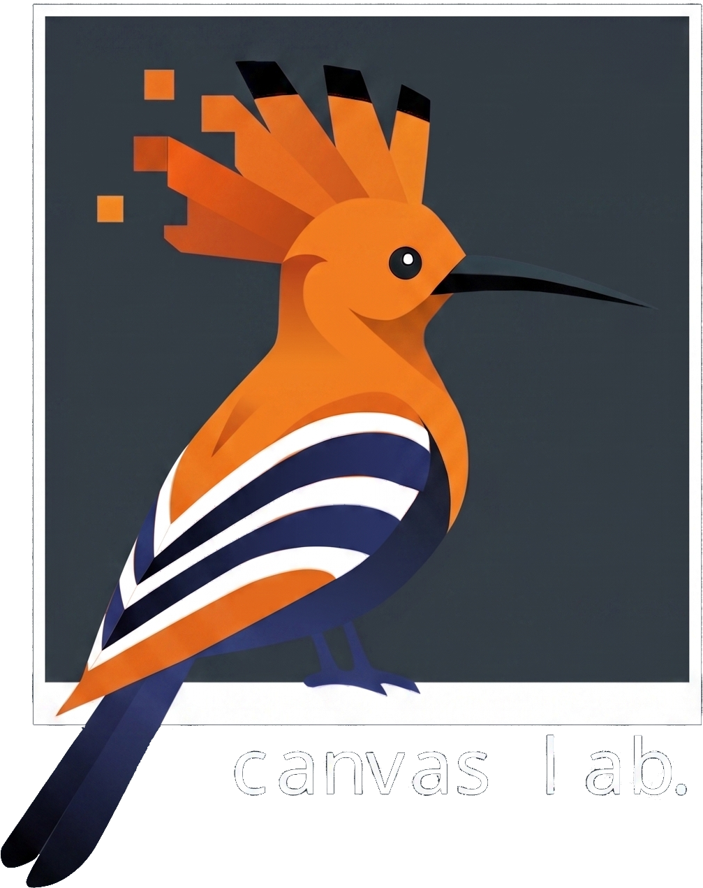

<table align="center">
  <tr>
    <td align="center" width="22%">
      
    </td>
    <td align="center" width="56%">
      <h2 style="font-size:36px; margin:0;">ϕ-Noise:<br>Training-Free Temporal Video Conditioning via Phase-Based Noise Manipulation</h2>
      <a href="https://arxiv.org/abs/2605.24509">
        
      </a>
      <a href="https://ofir1080.github.io/phi-noise/">
        
      </a>
      <a href="https://arxiv.org/pdf/2605.24509">
        
      </a>
    </td>
    <td align="center" width="22%">
      
    </td>
  </tr>
</table>

### An official implementatiton of the paper. ###

*Φ-Noise* enables motion and structure conditioning for diffusion-based video generation. By utilizing low-frequency components in either the spatial or temporal dimensions, it facilitates precise motion transfer and supports three key applications:
- Image-to-video motion Transfer
- Text-to-video Motion Transfer + Structural Conditioning
- Cut-n-Drag (interactive user control over object trajectories and spatial placement)

| **I2V Motion Transfer** | **T2V Motion Transfer** | **Cut n' Drag** |
| :---: | :---: | :---: |
|  |  |  |


### Contents ###
- `phi_noise_utils.py`: core frequency-mixing utilities.
- `video_processing_utils.py`: Video utilities: preprocessing and adjusting sizes/lengths.
- `Wan2.2_phi-noise/`: A fork of [Wan2.2 official GitHub](https://github.com/Wan-Video/Wan2.2) with small adjustments for the integration of our method. \
*Note*: You have to git-clone it from the root directory (`git clone git@github.com:ofir1080/Wan2.2_phi-noise.git`).


### Highlights ###
- *Φ-Noise* is **training-free** temporal conditioning via phase/magnitude mixing in frequency domain.
- this code (`freq_mix_temporal` and `freq_mix_spatial` in [phi_noise_utils.py](phi_noise_utils.py#L1-L220) can be integrated easily with any diffusion-based video model.
- We supply an example integration for Wan2.2 model [Wan2.2_phi-noise/generate.py](Wan2.2_phi-noise/generate.py#L1-L520).


### Installation ###
*Φ-Noise* uses [PyTorch](https://pytorch.org/) for frequecny decomposition (`torch.fft` module). \
For installation instruction of Wan2.2, please refer to [Wan2.2/INSTALL.md](https://github.com/Wan-Video/Wan2.2/blob/main/INSTALL.md).

### Usage ###

#### Φ-Noise + Wan2.2 ####

For a new input video, first preprocess it with `video_processing_utils.py` so the FPS, frame size, and clip length match the model requirements. This saves the preprocessed video in addition to the first frame (for I2V Motio Transfer).

Run the Wan example script (multi-GPU via torch.distributed.run). Make sure both the workspace root and the Wan folder are on `PYTHONPATH` so `phi_noise_utils` and `wan` import correctly. Example commands (adjust `--nproc_per_node`, `--ulysses_size`, `CUDA_VISIBLE_DEVICES`, and `--ckpt_dir`):

T2V Motion Trasfer + Structural Conditioning:
```bash
export PYTHONPATH=absolute-path/phi-noise/Wan2.2_phi-noise
export CUDA_VISIBLE_DEVICES=0,1,2,3,4,5,6,7
python -m torch.distributed.run \
  --nproc_per_node 8 --master_port 29501 Wan2.2_phi-noise/generate.py \
  --ulysses_size 8 --task t2v-A14B --size "832*480" --sample_steps 20 \
  --ckpt_dir /path/to/checkpoints --offload_model False --convert_model_dtype \
  --dit_fsdp --prompt "A yellow helicopter is flying in the beach. Camera is fixed and static. Fixed Background." \
  --pn_ref_path guidance_exmaples/preprocessed_14B-low_81f_duck.mp4 --pn_task t2v_mt \
  --pn_gamma 5 --pn_alpha 4
```

I2V Motion Trasfer:
```bash
export PYTHONPATH=absolute-path/to/phi-noise/Wan2.2_phi-noise
export CUDA_VISIBLE_DEVICES=0,1,2,3,4,5,6,7
python -m torch.distributed.run \
  --nproc_per_node 8 --master_port 29501 Wan2.2_phi-noise/generate.py \
  --ulysses_size 8 --task t2v-A14B --size "832*480" --sample_steps 20 \
  --ckpt_dir /path/to/checkpoints --offload_model False --convert_model_dtype \
  --dit_fsdp --prompt "The cat is turning its head towards the camera and after a second starts waving hello its right paw. Camera is fixed and static. Fixed Background." \
  --image "guidance_exmaples/mt-it2m/cat_in_nature.jpg" \
  --pn_ref_path guidance_exmaples/mt-it2m/preprocessed_14B-low_81f_woman_turning.mp4 \
  --pn_task i2v_mt \
  --pn_gamma 3 --pn_alpha 3
```

Cut n' Drag:
```bash
export PYTHONPATH=absolute-path/phi-noise/Wan2.2_phi-noise
export CUDA_VISIBLE_DEVICES=0,1,2,3,4,5,6,7
python -m torch.distributed.run \
  --nproc_per_node 8 --master_port 29501 Wan2.2_phi-noise/generate.py \
  --ulysses_size 8 --task i2v-A14B --size "832*480" --sample_steps 20 \
  --ckpt_dir /path/to/checkpoints --offload_model False --convert_model_dtype --dit_fsdp \
  --prompt "A flock of birds flies gracefully across the sky above a natural landscape." \
  --image "guidance_exmaples/cut_n_drag/preprocessed_14B-low_81f_birds_ff.png"\
  --pn_ref_path guidance_exmaples/cut_n_drag/preprocessed_14B-low_81f_birds.mp4 \
  --pn_task t2v_mt \
  --pn_gamma 30 --pn_alpha 3
```
*Tip*: To run with multiple gamma or alpha values, pass them with `#` separators, for example: `--pn_alpha arg1#arg2#arg3`.

#### General Usage ####
As utilities in your own code (recommended):

```python
from phi_noise_utils import freq_mix_temporal, freq_mix_spatial

# temporal Φ-noise (for I2V-related tasks)
latents = freq_mix_temporal(noise_latents, ref_latents, alpha=3, gamma=30.0) # recommended range values: gamma: alpha: [3-6], gamma: [30]

# spatial Φ-noise (for T2V Motion Transfer + Structural Conditioning)
mixed_latents = freq_mix_spatial(noise_latents, ref_latents, alpha=3, gamma=4.0, dims=("h","w")) # recommended range values: gamma: alpha: [3-4], gamma: [5-10]
```


### Citation ###
```
@article{abramovich2025phinoise,
  title   = {ϕ-Noise: Training-Free Temporal Video Conditioning
            via Phase-Based Noise Manipulation},
  author  = {Abramovich, Ofir and Cohen, Nadav Z. and
            Rosenthal, Adi and Shamir, Ariel},
  journal = {arXiv preprint},
  year    = {2025},
}
```

### Acknowledgments ###
This repository uses a fork of [Wan2.2](https://github.com/Wan-Video/Wan2.2) codebase.

### License ###
This project is licensed under the **Apache License 2.0**.
